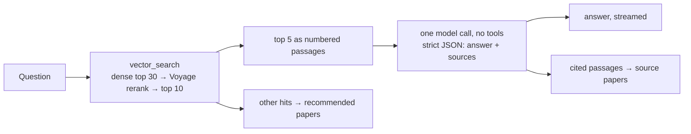

# Paper Research Agent

**English** | [中文](README.zh-CN.md)

A question-answering agent over a collection of research papers, built with LangGraph, MCP and Milvus. You ask a question about the papers and get back an answer that sticks to what the papers say, the passages it was based on, and related papers from the collection.

It started as a course project: a tool-calling agent that answered most questions but padded them with claims the sources didn't support. Most of the work since then has gone into measuring that properly and fixing it, with every change checked against a fixed question set.

| | Course version | Now |
|---|---:|---:|
| Correct and faithful answers (104-question dev set) | 16% | **76.9%** |
| Same, on 44 held-out questions (vs. the tool-calling agent on the same questions) | | **63.6%** (vs 47.7%) |
| Unfaithful answers | 82% | 6.7% |
| Questions left unanswered (agent looped until the step limit) | 10.6% | 0% |
| Latency p50 / p95 | 30 s / 101 s | 3.1 s / 5.9 s |
| Cost per question | ~$0.02 | $0.0002 |
| Retrieval Recall@1 | 0.625 | 0.865 |


---

## Contents

1. [How a question gets answered](#how-a-question-gets-answered)
2. [Architecture](#architecture)
3. [Evaluation](#evaluation)
4. [Engineering notes](#engineering-notes)
5. [Running it](#running-it)
6. [API](#api)
7. [Configuration](#configuration)
8. [Limitations](#limitations)
9. [Background: the course version](#background-the-course-version)

---

## How a question gets answered

There are two modes, set by `AGENT_MODE`. The evaluated setup uses `fast`.

**Fast path** (`AGENT_MODE=fast`). The code does the search, the model only writes:



- The model sees five numbered passages and a short set of rules: every statement must come from a passage, no purposes, consequences or importance the passages don't state, and say so if the answer isn't there.
- The reply is constrained by a strict JSON schema (`{"answer": str, "sources": [int]}`), so it always parses.
- Source papers are the papers of the passages the model cited. Recommendations are other papers from the same search. Nothing returned can be a paper that isn't in the index.
- For non-English questions the model writes the answer directly in the requested language.

**Tool-calling loop** (`AGENT_MODE=loop`). The original design: a LangGraph `llm ⇄ tools` graph where the model decides when and how often to call `vector_search` and `translate`. It is kept for comparison; on the evaluation it is slower, costs about 5x more and is less faithful (see below).

Every request can be traced in LangSmith as one tree, which shows where the time goes:


---

## Architecture

```
 Browser
    │
 streamlit (:8080)        answers stream in token by token; shows the cited passages
    │  POST /invoke/stream (SSE), /invoke, /upload, GET /stats
    ▼
 mcp-host (:8000)         FastAPI + LangGraph agent
    │  one long-lived MCP session (streamable HTTP), reconnects on its own
    ▼
 mcp-server (:9000)       FastMCP tools: vector_search, retrieve, index_paper, get_stats, translate, search_paper_url
    │                 │                         │
 Milvus (:19530)   Gemini embeddings,        translation-service (:7000)
 dense + BM25      Voyage rerank API
```

| Service | What it does |
|---|---|
| `streamlit/` | Upload PDFs by domain, ask questions, see the answer stream in with the passages it used |
| `mcp-host/` | FastAPI server and the agent (`src/agent/graph.py`). Holds one MCP session and one compiled graph for the life of the process |
| `mcp-server/` | Tool server. Chunking (`chunking.py`, shared with the eval scripts), embedding, search, rerank (`retrieval.py`). `retrieve` is the eval-only variant of `vector_search` with explicit mode and rerank flags; `search_paper_url` is kept but no longer called |
| `translation-service/` | Small translation API used by the loop agent's `translate` tool |
| `eval/` | Question generation, retrieval metrics, agent runs, LLM judge, human calibration |
| `scripts/` | Bulk ingestion with resume, latency benchmark |

Papers are split into 800-character chunks with 120 characters of overlap, embedded with `gemini-embedding-001` (3072 dimensions) and stored in a Milvus collection with a dense HNSW index and a BM25 sparse field that Milvus computes from the text. PDFs are passed to the tool server by path on a shared volume, not inside MCP messages, which have a 4 MB limit.

---

## Evaluation

Every change to retrieval or the agent is measured against a fixed question set, so improvements show up as numbers instead of impressions.

### Question set

- 104 single-hop questions generated from the 30 indexed papers (`eval/questions_single_hop.jsonl`), roughly even across the three domains.
- Each question is written by an LLM (DeepSeek, a different model family from the chat models under test) from one sampled chunk; that chunk becomes the gold answer, identified by `(filename, chunk_id)`.
- Code-level filters drop what the prompt alone didn't prevent: chunks that are mostly tables or reference lists, and questions that copy a 5-word run from their passage (copied wording makes retrieval look easier than it is).
- Chunking lives in one module (`mcp-server/chunking.py`) used by both indexing and question generation, with `pypdf` and the text splitter pinned. An earlier mismatch between library versions shifted chunk ids (2,970 vs 2,998 chunks), which would have silently broken every gold label.

### Grading

The agent returns the chunks it actually retrieved along with the answer. A DeepSeek judge grades each answer on two separate axes:

- **correctness** (0/1/2): the reference answer is split into key points, including comparisons and qualifiers; missing any one caps the score at 1.
- **faithful** (yes/no): every claim, including stated purposes, consequences and "this is critical" judgements, must be supported by the chunks the agent retrieved. Correct general knowledge that isn't in them still counts as unfaithful, since the reader can't tell where it came from.

The headline metric is **correct and faithful**: full marks on correctness and no unsupported claims.

**Judge calibration.** 20 answers were labelled by hand, on the same retrieved chunks the judge sees, without showing the judge's scores.

| Judge prompt | Correctness agreement | Faithfulness agreement | Pass/fail agreement |
|---|---:|---:|---:|
| v1 | 65% | 75% | 65% |
| v2 (key-point breakdown, explicit rule on added purposes/consequences) | 85% | 65% | 75% |

v1 was lenient in 11 of 12 disagreements; v2 fixed correctness but overshoots on faithfulness (strict in 6 of 7). v2 is the judge of record because its aggregate rates are closest to the human labels (human: 20% pass, 70% unfaithful on the sample). The prompt was tuned on these same 20 answers, so agreement is optimistic.

### Baseline

Retrieval: dense only, HNSW, cosine, domain filter on.

| Metric | Strict | Lenient (adjacent chunk counts) |
|---|---:|---:|
| Recall@1 | 0.625 | 0.721 |
| Recall@3 | 0.827 | 0.894 |
| Recall@5 | 0.913 | 0.942 |
| Recall@10 | 0.933 | 0.952 |
| MRR | 0.736 | 0.816 |
| Right paper in top 5 | 1.000 | |

Two metrics are reported because chunks overlap: the sentence a question came from often also sits at the edge of the neighbouring chunk. Of the 39 questions missed at rank 1, 10 had the adjacent chunk ranked first. The right paper is always in the top 5 and dropping the domain filter changes almost nothing, so this corpus only tests finding the passage, not the paper.

Answers (tool-calling agent, Gemini 3 Flash): 11 of 104 questions never finished because the agent looped until the 25-step limit, 82% of answered questions were unfaithful, and only **16%** were correct and faithful, at 30 s p50 and ~$0.02 per question. The agent usually found and stated the right answer, then padded it with claims the retrieved text didn't support, e.g. "which is critical for synchronizing behavioral data with neural activity" after a correctly cited fact about timing precision. Retrieval was not the bottleneck; generation was.

### What changed, run by run

Every row is a full run over the same 104 questions, graded by the same judge. Runs are noisy: the agent and the judge are both sampled, and at around 60% a gap between two 104-question runs needs to be roughly 13 points before it is clearly more than noise. Where it matters, configurations are compared question by question instead.

| Run | Change | Correct & faithful | Unfaithful (of answered) | Latency p50 / p95 | Cost / question |
|---|---|---:|---:|---:|---:|
| v0 | baseline: Gemini 3 Flash, tool loop, URL lookup | 16% | 82% | 30.0 s / 100.7 s | ~$0.02 |
| luna_base | chat model switched to GPT-6 Luna | 53.8% | 35.6% | 30.5 s / 56.8 s | $0.0017 |
| nolink | URL lookup taken out of the loop | 62.5% | 26.9% | 12.2 s / 17.4 s | $0.0011 |
| rerank | vector_search uses dense + rerank | 56.7% | 28.8% | 13.7 s / 22.4 s | $0.0011 |
| fast | one search, one model call | 62.5% | 5.8% | 2.9 s / 4.7 s | $0.0002 |
| fast2 | prompt asks for complete answers | 73.1% | 9.7% | 3.1 s / 5.0 s | $0.0002 |
| fast3 | strict JSON schema on the reply | **76.9%** | **6.7%** | **3.1 s / 5.9 s** | **$0.0002** |

#### Model and latency

The Gemini 3 Flash preview kept returning 503s under load, and every failed call cost ~30 s before timing out. On the first 20 questions GPT-6 Luna was no worse on quality, never hit the step limit, and cost about 1/8 as much per question. On the full set it answered all 104 questions.

`/invoke` returns per-request usage (LLM turns, tool calls, input / cached / output / reasoning tokens, time spent in the model), and `run_agent.py` aggregates it. That breakdown showed ~15 s of each answer going to paper URL lookups: Semantic Scholar rate-limited almost every call and the retries slept. The papers the model looked up were also almost never in the index. Taking the lookup out of the loop cut p50 from 30.5 s to 12.2 s and LLM turns per question from 5.7 to 3.7. The quality change (53.8% → 62.5%) is within noise.

#### Retrieval: hybrid search and reranking

The chunks were migrated to a new collection with a BM25 sparse field next to the dense vector, reusing the stored embeddings. Before comparing anything, dense search on the new collection reproduced the baseline exactly.

| | Dense | BM25 | Hybrid (RRF) | Dense + rerank | Hybrid + rerank |
|---|---:|---:|---:|---:|---:|
| Recall@1 | 0.625 | 0.519 | 0.635 | **0.865** | 0.856 |
| Recall@3 | 0.827 | 0.731 | 0.808 | 0.942 | 0.933 |
| Recall@5 | 0.913 | 0.798 | 0.846 | 0.962 | 0.962 |
| Recall@10 | 0.933 | 0.875 | 0.923 | 0.971 | 0.971 |
| MRR | 0.736 | 0.638 | 0.734 | **0.905** | 0.899 |
| Search p50 | 233 ms | | 206 ms | 506 ms | 500 ms |

Hybrid uses RRF (k = 60) over 50 candidates from each side; rerank is Voyage `rerank-3` over the top 30 first-stage hits.

- Equal-weight RRF barely moved Recall@1 and cost 7 points of Recall@5. BM25 is weak on these questions because the generator was told to paraphrase, which removes exact terms. RRF weights were not tuned, since the only data to tune them on is the test set.
- The gold chunk was in the top 10 of dense or BM25 for 101 of 104 questions, so candidates were fine and ordering was the problem. The cross-encoder reranker fixed 25 questions at rank 1 and broke none. After reranking BM25 added nothing, so it was dropped from the serving path; the code stays for the ablation.
- If the reranker API fails, search falls back to first-stage order. The eval script aborts in that case so a table never mixes reranked and un-reranked results.

Better ranking did not change the loop agent's answers. It searches two or three times and reads 12–13 passages per question, so even without reranking it had seen the gold chunk on 97 of 104 questions, and the answer was written after reading all of them. Reranking only pays off once the model sees a handful of passages, which is what the fast path does.

#### Fast path

- **fast.** Unfaithful answers dropped from 28.8% to 5.8%, but full-marks answers fell from 82 to 67. All 37 partially correct answers had the gold passage in context. Answers had gotten half as long (median 78 → 32 words): "keep it concise" combined with strict grounding made the model stop after the first fact that fit.
- **fast2.** The prompt now asks for every detail in the passages that bears on the question, with grounding taking precedence. Full marks went back to 83 (19 questions up, 1 down).
- **fast3.** fast2 produced 13 malformed replies, where the model wrote the answer as plain text followed by a separate `{"sources": [...]}`. The fast path now uses OpenAI structured outputs with a strict JSON schema, so the reply always parses: 0 malformed, and no passage numbers leaking into the text. The score change (76 → 80 questions, 7 up and 3 down) is noise; the point is that callers always get a clean answer and source list.

Against the loop agent, the fast path is 20 points higher on correct & faithful, about 4x faster and about 1/5 the cost. It changed the structure and the prompt together, so the gain can't be split between the two.

#### Held-out check

The fast-path prompt was revised after reading failures on these 104 questions, so the numbers above are optimistic. To check, 44 new questions were generated (`eval/questions_heldout.jsonl`) from chunks that neither the dev set's gold chunks nor their neighbours use. 46 came out of the generator; two had reference answers that didn't answer the question and were removed by hand. Both modes were run on the new set:

| Held-out, 44 questions | Loop agent | Fast path |
|---|---:|---:|
| Correct & faithful | 47.7% | **63.6%** |
| Correctness = 2 | 31 | 31 |
| Unfaithful | 38.6% | 13.6% |
| Latency p50 / p95 | 13.7 s / 19.6 s | 3.6 s / 8.4 s |
| Cost / question | $0.0011 | $0.0002 |

Both modes score lower than on the dev set, so the new questions are harder. The gap between them stays close (+16 points vs +20 on dev), which is what you would not see if the prompt only fit the dev questions. Question by question, correctness is the same in both modes (31 full marks each). The difference is faithfulness: 12 questions faithful only in fast mode and 1 only in loop mode (exact McNemar p ≈ 0.003). For correct & faithful it is 9 vs 2 (p ≈ 0.07 at this sample size). The fast path doesn't find more of the answer; it adds less that isn't there.

#### Where the remaining errors are, and what that rules out

The questions the fast path still misses, by cause:

| | Dev (24 misses) | Held-out (16 misses) |
|---|---:|---:|
| Gold passage not retrieved | 2 | 0 |
| Retrieved, but the answer leaves out a key point | 15 | 10 |
| Complete, but adds an unsupported claim | 3 | 3 |
| Both incomplete and unfaithful | 3 | 3 |
| Wrong | 1 | 0 |

Most misses are answers that are right but leave out one secondary point. This was used to decide what not to build. Corrective retrieval (grade the passages, rewrite the query, search again) targets the first row, which is 2 questions out of 148. Sentence-level citation checking targets unfaithfulness, now around 7%, at the price of a second model call per question. A router that sends hard questions to the loop agent needs multi-hop questions to show any effect, and this set has none. None of them were worth adding on this evidence; the next step would be a multi-hop question set to find out whether the one-search design breaks down there.

### Reproduce

With the stack running and papers ingested:

```bash
pip install -r eval/requirements.txt
python -m pytest eval/tests -q                                               # metric unit tests
python eval/run_retrieval.py --mode dense --rerank --label v2_dense_rerank   # retrieval
python eval/run_agent.py --label fast3 --workers 3                           # answers (AGENT_MODE=fast)
python eval/judge_answers.py --answers fast3 --label fast3_j2                # judge
python eval/run_agent.py --questions eval/questions_heldout.jsonl --label ho_fast
python eval/judge_answers.py --questions eval/questions_heldout.jsonl --answers ho_fast --label ho_fast_j2
python eval/calibrate.py sheet --judged fast3_j2                             # human labelling sheet
```

`run_agent.py` resumes where it stopped and retries failed questions; `--limit N` runs a smoke test on the first N. A full 104-question run costs about $0.02 in the fast path plus a few cents of judging.

---

## Engineering notes

**One MCP session per process.** The course version opened a new MCP client and rebuilt the graph on every request. Now the session is opened at startup inside its own asyncio task (anyio cancel scopes must be exited by the task that entered them, so this lets a reconnect open a new session and close the old one in any order), and every request reuses it.

**Surviving a tool-server restart.** A dropped MCP session doesn't always raise; a call on it can simply never return. Three things cover that: the session is pinged before each run and reopened if it's dead, reconnecting retries with backoff (1, 2, 4 s) while the tool server is still starting, and every tool call made through the graph has a time limit, which turns a hang into an error the reconnect logic handles. Each case has an integration test against a fake tool server that is actually killed and restarted.

**Tool errors.** Errors from tools the model calls go back to the model as tool messages, so it can correct itself. Errors from tools the code calls directly have no model to handle them: read-only tools are retried once (the usual cause is a transient 503 from the embedding API), writes like `index_paper` are not, and the optional recommendation backfill degrades to fewer recommendations instead of failing the request.

**Streaming with structured output.** Strict JSON output and token streaming don't fit together naturally: the model streams `{"answer": "...", "sources": [...]}`, which isn't parseable until it's complete, and forwarding it raw would show JSON to the user. `AnswerStream` (`parsing.py`) extracts the `answer` string incrementally as tokens arrive, waiting for escape sequences and surrogate pairs to complete before emitting them. `/invoke/stream` sends these as server-sent events, then one final event with the same payload as `/invoke`.

**Observability.** With `LANGSMITH_TRACING=true`, each fast-path request is recorded as one tree (`fast_answer` → `vector_search` + the model call) with inputs, outputs, timings and token counts. Per-request usage is also returned by `/invoke`, which is what the eval scripts aggregate.

**Startup order.** Compose healthchecks make each service wait for its dependencies; `mcp-host` only reports healthy once it holds an MCP session, so `docker compose up --wait` returns when the system can actually answer.

**Tests.** 40 tests in `mcp-host` (unit tests plus integration tests that run the real graph and MCP session against a local fake tool server and a scripted model, no API keys needed) and unit tests for the eval metrics (`eval/tests`).

---

## Running it

```bash
cp .env.example .env                  # set OPENAI_API_KEY, GOOGLE_API_KEY (embeddings), VOYAGE_API_KEY (rerank)
docker compose up -d --build --wait   # Milvus + translation + mcp-server + mcp-host + streamlit
# put PDFs under papers/AI, papers/Security, papers/Other, then:
python scripts/ingest_papers.py --dir papers
```

UI at http://localhost:8080, API docs at http://localhost:8000/docs. `ingest_papers.py` retries on rate limits and skips files it has already indexed, so it can be re-run safely.

To stop the stack use `docker compose stop`. `docker compose down -v` also deletes the Milvus volume, and re-indexing costs embedding calls.

Tests:

```bash
cd mcp-host
pip install -r requirements-dev.txt
python -m pytest -q
```

Latency benchmark against a running stack:

```bash
python scripts/bench_latency.py --n 30 --concurrency 1 --label after
```

---

## API

`mcp-host`, port 8000:

| Method | Path | Description |
|---|---|---|
| GET | `/ok` | Health; `mcp: true` once the tool session is up |
| POST | `/invoke` | Answer a question |
| POST | `/invoke/stream` | Same, as server-sent events |
| POST | `/upload` | Index a PDF into a domain |
| GET | `/stats` | Papers per domain |

`POST /invoke`:

```json
{"query": "How does vLLM reduce the memory copying overhead caused by beam search candidates sharing a KV cache?",
 "language": "English", "domain": "AI"}
```

```json
{
  "answer": "vLLM uses physical block sharing so most KV-cache blocks can be shared across beam candidates instead of copied. It applies copy-on-write only when a candidate's newly generated tokens fall within an old shared block, so only that one block must be copied. ...",
  "papers": [{"title": "Efficient Memory Management for Large Language.pdf", "url": ""}],
  "recommended_papers": [{"title": "...", "url": ""}, {"title": "...", "url": ""}],
  "language": "English",
  "contexts": [{"filename": "Efficient Memory Management for Large Language.pdf", "chunk_id": 56, "content": "..."}],
  "usage": {"mode": "fast", "llm_turns": 1, "tool_calls": ["vector_search"], "cited": [1, 2],
            "input_tokens": 1210, "output_tokens": 179, "latency_ms": 3400, "model": "openai:gpt-6-luna"}
}
```

`contexts` are the passages the model saw (numbered from 1 in order); `usage.cited` says which of them the answer is based on.

`POST /invoke/stream` takes the same body and returns `text/event-stream`:

```
data: {"type": "delta", "text": "vLLM uses physical "}
data: {"type": "delta", "text": "block sharing so most"}
...
data: {"type": "done", "result": { ...same as /invoke... }}
```

On failure the stream ends with `{"type": "error", "detail": "..."}`. In loop mode only the final `done` event is sent.

---

## Configuration

Read from `.env` by docker compose. `.env.example` has the evaluated settings; the code defaults (in parentheses where different) are the original behaviour.

| Variable | Service | Default | Description |
|---|---|---|---|
| `OPENAI_API_KEY` | mcp-host | | Required when `LLM_MODEL` is `openai:…` |
| `GOOGLE_API_KEY` | mcp-server | | Gemini embeddings (and the chat model if `LLM_MODEL` is `google:…`) |
| `VOYAGE_API_KEY` | mcp-server | | Required when `RETRIEVAL_RERANK=true` |
| `LLM_MODEL` | mcp-host | `openai:gpt-6-luna` (`google:gemini-3-flash-preview`) | Chat model as `provider:model`, `google` or `openai` |
| `LLM_REASONING_EFFORT` | mcp-host | provider default | `low` / `medium` / `high` for reasoning models |
| `AGENT_MODE` | mcp-host | `fast` (`loop`) | `fast`: one search in code, one model call. `loop`: the model calls tools until it answers |
| `FAST_CONTEXT_K` / `FAST_SEARCH_K` | mcp-host | `5` / `10` | Fast mode: passages shown to the model / hits fetched (the rest feed recommendations) |
| `AGENT_RECURSION_LIMIT` | mcp-host | `25` | Loop mode: max model ⇄ tool steps |
| `AGENT_TIMEOUT_S` | mcp-host | `120` | Per-request time limit |
| `RETRIEVAL_MODE` | mcp-server | `dense` | `dense`, `bm25` or `hybrid` (RRF) for `vector_search` |
| `RETRIEVAL_RERANK` | mcp-server | `true` (`false`) | Rerank first-stage hits with Voyage |
| `RERANK_MODEL` / `RERANK_CANDIDATES` | mcp-server | `rerank-3` / `30` | Reranker model and how many first-stage hits it sees |
| `MILVUS_URI` / `MILVUS_TOKEN` | mcp-server | `http://localhost:19530` / empty | Milvus connection |
| `MILVUS_COLLECTION` | mcp-server | `research_papers_v2` | Dense vector + BM25 sparse field |
| `GEMINI_EMB_MODEL` | mcp-server | `gemini-embedding-001` | Embedding model |
| `CHUNK_SIZE` / `CHUNK_OVERLAP` | mcp-server | `800` / `120` | Characters |
| `LANGSMITH_TRACING` / `LANGSMITH_API_KEY` / `LANGSMITH_PROJECT` | mcp-host | `false` / empty / `research-agent` | Request tracing |
| `DEEPSEEK_API_KEY` / `EVAL_MODEL` | eval scripts | / `deepseek:deepseek-chat` | Question generation and judging |
| `LOG_LEVEL` | all | `INFO` | Logs are JSON lines with a request id |

---

## Limitations

- **Single-hop questions only.** Every evaluation question is answered by one passage. Questions that compare papers or combine several passages aren't measured, and the fast path's one search may not be enough for them.
- **One judge model**, calibrated on 20 hand-labelled answers that were also used to write its prompt. Its faithfulness calls lean strict.
- **Small, easy corpus.** 30 papers in three unrelated domains: finding the right paper is trivial, so retrieval results only say something about finding the right passage.
- **Answers tend to leave out secondary points** (the largest group of remaining misses). One known wrong answer (q003) says the passages don't name a brain region when they do; the list is probably split across lines by PDF table extraction.
- **No conversation memory.** Each question is answered on its own.
- **Paper links are empty.** The Semantic Scholar lookup was removed from the answer path because of rate limits; resolving links once at indexing time would bring them back without the latency.
- **Language is chosen by the user**, not detected, and PDFs must contain extractable text (no OCR).

---

## Background: the course version

The project began as a course assignment (research-assistant agent with a RAG pipeline). That version had the same services, used Gemini 3 Flash as the agent with Semantic Scholar URL lookups, and was deployed on GKE with a horizontal pod autoscaler on Milvus (1–5 pods at 70% CPU) and on the agent. The Kubernetes setup isn't part of this repository; local runs use docker compose.

It also compared three Milvus index types on the same 2,998 chunks (from before chunking was pinned), using `index/milvus_index.py`:

| Index | Build time | Total ingest time | Index size |
|---|---:|---:|---:|
| HNSW (`M=16, efConstruction=200`) | 4.4 s | 68.9 s | ~33 MiB |
| IVF_PQ (`nlist=128, m=16, nbits=8`) | 6.2 s | 78.4 s | ~3.6 MiB |
| DiskANN | 26.6 s | 99.3 s | ~40 MiB |

Embedding took ~47 s in every case, so index choice barely matters for ingestion at this size. IVF_PQ is about 9x smaller than HNSW at some cost in recall; DiskANN is built for disk-resident indexes far larger than this one and gains nothing here. HNSW is what the system uses.

Course demo videos (course version): [functional demo](https://drive.google.com/file/d/1WAJR-9c0TGYAs5xYudgf5YG1yrNYmmVG/view?usp=sharing), [code walkthrough](https://drive.google.com/file/d/1IWi8nq0XTAKhtk53FBtC684qcUNB0XFm/view?usp=sharing).
