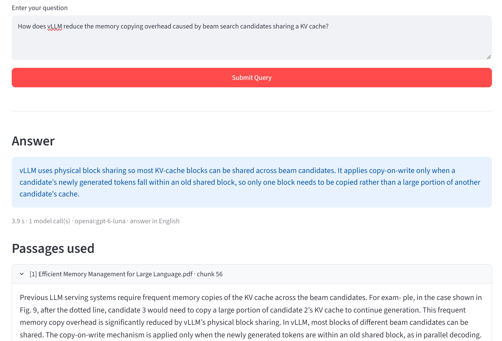
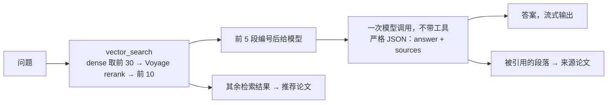
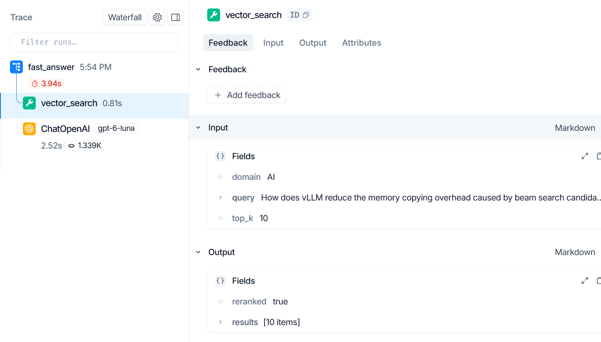

<p align="center">
  <picture>
    <source media="(prefers-color-scheme: dark)" srcset="docs/logo-dark.svg">
    
  </picture>
</p>

<p align="center">
<b>基于论文库、只依据原文作答的问答 agent。</b>一次检索、一次模型调用，每个答案都附上它引用的原文段落。<br/>在固定题集上逐步评测：正确且忠实从 16% 提升到 76.9%，每题 3 秒、$0.0002。
</p>

<p align="center">
  <a href="#架构"></a>
  <a href="#架构"></a>
  <a href="#架构"></a>
  <a href="#架构"></a>
  <a href="#架构"></a>
  <a href="#架构"></a>
  <a href="#运行"></a>
  <a href="#工程要点"></a>
</p>

<p align="center"><a href="README.md">English</a> | <b>中文</b></p>

项目起点是一门课的作业：一个靠工具调用的 agent，大多数问题都能答上，但会在答案里掺进原文没有的说法。之后的工作主要就是把这个问题测清楚、再修好，每一处改动都在同一套固定题目上验证过。

| | 课程版 | 现在 |
|---|---:|---:|
| 正确且忠实的回答（104 道开发集） | 16% | **76.9%** |
| 同上，44 道验证集（括号内为同一批题上的工具调用 agent） | | **63.6%**（47.7%） |
| 不忠实的回答 | 82% | 6.7% |
| 没答出来的题（agent 循环调用直到步数上限） | 10.6% | 0% |
| 延迟 p50 / p95 | 30 s / 101 s | 3.1 s / 5.9 s |
| 每题成本 | 约 $0.02 | $0.0002 |
| 检索 Recall@1 | 0.625 | 0.865 |



---

## 目录

1. [一个问题是怎么被回答的](#一个问题是怎么被回答的)
2. [架构](#架构)
3. [评测](#评测)
4. [工程要点](#工程要点)
5. [运行](#运行)
6. [API](#api)
7. [配置](#配置)
8. [局限](#局限)
9. [背景：课程版](#背景课程版)

---

## 一个问题是怎么被回答的

有两种模式，由 `AGENT_MODE` 决定。评测用的是 `fast`。

**快路径**（`AGENT_MODE=fast`）。检索由代码完成，模型只负责写答案：



- 模型看到 5 段编号的原文和几条简短规则：每句话都要有原文支撑；不添加原文没说的用途、后果或重要性判断；原文里没有答案就直说。
- 回复受严格 JSON schema 约束（`{"answer": str, "sources": [int]}`），所以一定能解析。
- 来源论文取自模型引用的段落，推荐论文取自同一次检索的其他结果。返回的每篇论文都在库里，不会出现编造的论文。
- 问题不是英文时，模型直接用对应语言写答案。

**工具调用循环**（`AGENT_MODE=loop`）。最初的设计：一个 LangGraph `llm ⇄ tools` 图，由模型决定何时、调用几次 `vector_search` 和 `translate`。保留下来做对比；在评测中它更慢、成本约为 5 倍，也更容易不忠实（见下文）。

每个请求都可以在 LangSmith 里记成一棵 trace 树，时间花在哪一步一目了然：



---

## 架构

```
 浏览器
    │
 streamlit (:8080)        答案逐字显示，并列出引用的原文段落
    │  POST /invoke/stream (SSE)、/invoke、/upload，GET /stats
    ▼
 mcp-host (:8000)         FastAPI + LangGraph agent
    │  一条长连接 MCP 会话（streamable HTTP），断开后自动重连
    ▼
 mcp-server (:9000)       FastMCP 工具：vector_search、retrieve、index_paper、get_stats、translate、search_paper_url
    │                 │                         │
 Milvus (:19530)   Gemini embedding、        translation-service (:7000)
 dense + BM25      Voyage rerank API
```

| 服务 | 作用 |
|---|---|
| `streamlit/` | 按领域上传 PDF、提问，答案逐字出现，并显示所依据的段落 |
| `mcp-host/` | FastAPI 服务和 agent（`src/agent/graph.py`）。整个进程只持有一个 MCP 会话和一张编译好的图 |
| `mcp-server/` | 工具服务器。切段（`chunking.py`，和评测脚本共用）、embedding、检索、rerank（`retrieval.py`）。`retrieve` 是 `vector_search` 的评测专用版本，可以显式指定检索模式和是否 rerank；`search_paper_url` 保留但已不再调用 |
| `translation-service/` | 小型翻译服务，供多轮 agent 的 `translate` 工具使用 |
| `eval/` | 出题、检索指标、agent 作答、LLM 裁判、人工校准 |
| `scripts/` | 可断点续传的批量入库、延迟压测 |

论文按 800 字符切段、重叠 120 字符，用 `gemini-embedding-001`（3072 维）做 embedding，存进 Milvus 的一个 collection：一个 dense HNSW 索引，外加一个由 Milvus 从原文自动计算的 BM25 稀疏字段。PDF 通过共享卷按路径交给工具服务器，而不是塞进 MCP 消息里（MCP 消息有 4 MB 上限）。

---

## 评测

检索或 agent 的每一处改动，都在同一套固定题目上测量，所以改进体现为数字，而不是感觉。

### 题目

- 104 道单跳题，由库里 30 篇论文生成（`eval/questions_single_hop.jsonl`），三个领域大致均分。
- 每道题由 LLM（DeepSeek，和被测的聊天模型不是同一家）根据随机抽取的一段原文出题；这一段就是标准答案所在的段落，用 `(filename, chunk_id)` 标识。
- 用代码过滤掉 prompt 没能挡住的情况：以表格或参考文献为主的段落，以及题目照抄原文连续 5 个词的题（照抄会让检索显得比实际容易）。
- 切段逻辑只在一个模块里（`mcp-server/chunking.py`），入库和出题共用，并锁定了 `pypdf` 和文本切分库的版本。之前两边库版本不一致，切出来的段数不同（2,970 对 2,998），会让所有标准答案的编号悄悄错位。

### 打分

agent 返回答案的同时，会返回它实际检索到的段落。DeepSeek 裁判从两个独立的维度给每个答案打分：

- **正确性**（0/1/2）：参考答案拆成若干要点，包括比较关系和限定条件；漏掉任何一点最多得 1 分。
- **忠实性**（是/否）：每一条说法，包括补充的用途、后果和"这很关键"之类的判断，都必须能在 agent 实际检索到的段落里找到依据。即使是正确的常识，只要段落里没有，也算不忠实，因为读者分辨不出它从哪来。

主指标是**正确且忠实**：正确性满分，并且没有任何无依据的说法。

**裁判校准。** 人工标注了 20 个答案，标注时看的是和裁判相同的检索段落，并且看不到裁判的打分。

| 裁判 prompt | 正确性一致率 | 忠实性一致率 | 合格/不合格一致率 |
|---|---:|---:|---:|
| v1 | 65% | 75% | 65% |
| v2（要点拆分，并明确规定补充用途/后果算不忠实） | 85% | 65% | 75% |

v1 在 12 次分歧里有 11 次偏宽松；v2 修好了正确性，但忠实性偏严（7 次分歧里 6 次偏严）。最终采用 v2，因为它给出的整体比例最接近人工（人工在这批样本上：20% 合格、70% 不忠实）。prompt 是在这 20 个答案上调的，所以一致率偏乐观。

### 基线

检索：只用 dense，HNSW，余弦相似度，开启领域过滤。

| 指标 | 严格 | 宽松（相邻段也算对） |
|---|---:|---:|
| Recall@1 | 0.625 | 0.721 |
| Recall@3 | 0.827 | 0.894 |
| Recall@5 | 0.913 | 0.942 |
| Recall@10 | 0.933 | 0.952 |
| MRR | 0.736 | 0.816 |
| 前 5 名里有正确论文 | 1.000 | |

之所以报两套指标，是因为段落之间有重叠：出题的那句话经常也落在相邻段落的边缘。第 1 名没命中的 39 道题里，有 10 道排第一的是相邻段。正确论文总在前 5 名里，去掉领域过滤几乎没有变化，所以这个语料只能测"在论文里找到段落"，测不了"找到论文"。

作答（工具调用 agent，Gemini 3 Flash）：104 道题里有 11 道没答出来，因为 agent 循环调用直到 25 步上限；答出来的里面 82% 不忠实；**正确且忠实只有 16%**，p50 延迟 30 秒，每题约 $0.02。agent 通常能找到并说出正确答案，然后再补上检索内容里没有的说法，比如在正确引用一条关于计时精度的事实之后，加上"这对行为数据和神经活动的同步至关重要"。瓶颈不在检索，而在生成。

### 逐轮改动

每一行都是同一批 104 道题的完整一轮，用同一个裁判打分。结果有随机波动：agent 和裁判都有采样随机性，在 60% 左右的水平上，两轮 104 道题之间要差大约 13 个点，才能明确说不是噪声。关键的对比改用逐题配对来看。

| 轮次 | 改动 | 正确且忠实 | 不忠实（占已答） | 延迟 p50 / p95 | 每题成本 |
|---|---|---:|---:|---:|---:|
| v0 | 基线：Gemini 3 Flash，工具循环，查论文链接 | 16% | 82% | 30.0 s / 100.7 s | 约 $0.02 |
| luna_base | 聊天模型换成 GPT-6 Luna | 53.8% | 35.6% | 30.5 s / 56.8 s | $0.0017 |
| nolink | 把查链接移出循环 | 62.5% | 26.9% | 12.2 s / 17.4 s | $0.0011 |
| rerank | vector_search 改为 dense + rerank | 56.7% | 28.8% | 13.7 s / 22.4 s | $0.0011 |
| fast | 一次检索、一次模型调用 | 62.5% | 5.8% | 2.9 s / 4.7 s | $0.0002 |
| fast2 | prompt 要求答全 | 73.1% | 9.7% | 3.1 s / 5.0 s | $0.0002 |
| fast3 | 回复加严格 JSON schema | **76.9%** | **6.7%** | **3.1 s / 5.9 s** | **$0.0002** |

#### 模型与延迟

Gemini 3 Flash 预览版在高负载时频繁返回 503，每次失败都要白等约 30 秒才超时。在前 20 道题上，GPT-6 Luna 质量不比它差，从没碰到步数上限，每题成本约为 1/8。全量 104 道题全部答上。

`/invoke` 会返回每个请求的用量（模型轮数、工具调用次数、输入/缓存/输出/推理 token、模型耗时），由 `run_agent.py` 汇总。这份数据显示，每个回答约有 15 秒花在查论文链接上：Semantic Scholar 几乎每次都限流，重试时在 sleep。而且模型去查的那些论文几乎都不在库里。把查链接移出循环后，p50 从 30.5 秒降到 12.2 秒，每题模型轮数从 5.7 降到 3.7。质量变化（53.8% → 62.5%）在噪声范围内。

#### 检索：混合检索与 rerank

把段落迁移到一个新 collection，在 dense 向量旁边加了 BM25 稀疏字段，复用已有的 embedding。比较之前，先确认新 collection 上的 dense 检索和基线完全一致。

| | Dense | BM25 | Hybrid（RRF） | Dense + rerank | Hybrid + rerank |
|---|---:|---:|---:|---:|---:|
| Recall@1 | 0.625 | 0.519 | 0.635 | **0.865** | 0.856 |
| Recall@3 | 0.827 | 0.731 | 0.808 | 0.942 | 0.933 |
| Recall@5 | 0.913 | 0.798 | 0.846 | 0.962 | 0.962 |
| Recall@10 | 0.933 | 0.875 | 0.923 | 0.971 | 0.971 |
| MRR | 0.736 | 0.638 | 0.734 | **0.905** | 0.899 |
| 检索 p50 | 233 ms | | 206 ms | 506 ms | 500 ms |

Hybrid 用 RRF（k = 60），两边各取 50 个候选；rerank 用 Voyage `rerank-3`，对第一阶段的前 30 个结果重排。

- 等权 RRF 几乎没提升 Recall@1，反而让 Recall@5 掉了 7 个点。BM25 在这批题上偏弱，因为出题时要求改写措辞，去掉了原文里的关键词。没有调 RRF 权重，因为唯一能拿来调的数据就是测试集本身。
- 104 道题里有 101 道，正确段落在 dense 或 BM25 的前 10 名里，所以候选没问题，问题出在排序。cross-encoder rerank 让 25 道题的第 1 名从错变对，没有弄坏任何一道。rerank 之后 BM25 不再带来提升，所以线上检索不再用它，代码留着做消融。
- rerank API 失败时，检索退回第一阶段的顺序。评测脚本遇到这种情况会直接中止，保证表格里不会混进没 rerank 的结果。

检索变准并没有改变多轮 agent 的回答。它每题检索两三次、读 12–13 段，即使不 rerank，104 道题里也有 97 道看到了正确段落，而答案是读完所有段落后才写的。只有当模型只看少数几段时，rerank 才有用，快路径正是这样。

#### 快路径

- **fast。** 不忠实从 28.8% 降到 5.8%，但满分答案从 82 降到 67。37 道只得 1 分的题，正确段落都在模型看到的内容里。答案长度减半（中位数 78 → 32 词）："简洁作答"加上严格的依据要求，让模型写完第一条符合的事实就停了。
- **fast2。** prompt 改成要求写出段落里和问题相关的所有细节，同时依据要求优先。满分回到 83（19 道上升，1 道下降）。
- **fast3。** fast2 有 13 个回复格式错误：模型先用纯文本写答案，再单独接一个 `{"sources": [...]}`。现在快路径使用 OpenAI 的结构化输出和严格 JSON schema，回复一定能解析：格式错误 0 个，正文里也不再混入段落编号。分数变化（76 → 80 道，7 道上升、3 道下降）属于噪声；这一步的意义是调用方拿到的一定是干净的答案和来源列表。

和多轮 agent 相比，快路径的正确且忠实高 20 个点，速度约快 4 倍，成本约为 1/5。结构和 prompt 是一起改的，所以无法把提升拆分到两者各自头上。

#### 验证集检查

快路径的 prompt 是看着这 104 道题的错题改的，所以上面的数字偏乐观。为了检验，另外生成了 44 道新题（`eval/questions_heldout.jsonl`），出题段落既不是开发集的标准答案段落，也不是它们的相邻段。生成器出了 46 道，其中两道的参考答案没有回答问题，人工删掉。两种模式都在新题上跑了一遍：

| 验证集，44 道 | 多轮 agent | 快路径 |
|---|---:|---:|
| 正确且忠实 | 47.7% | **63.6%** |
| 正确性 = 2 | 31 | 31 |
| 不忠实 | 38.6% | 13.6% |
| 延迟 p50 / p95 | 13.7 s / 19.6 s | 3.6 s / 8.4 s |
| 每题成本 | $0.0011 | $0.0002 |

两种模式在验证集上的分数都比开发集低，说明新题更难。但两者的差距基本保持（+16 个点，开发集是 +20）；如果 prompt 只是拟合了开发集，就不会是这样。逐题看，两种模式的正确性一样（都是 31 道满分），差别在忠实性：只在快路径忠实的有 12 道，只在多轮忠实的有 1 道（精确 McNemar 检验 p ≈ 0.003）。正确且忠实是 9 对 2（这个样本量下 p ≈ 0.07）。快路径并没有找到更多答案，它只是更少添加原文没有的东西。

#### 剩下的错误在哪，以及据此决定不做什么

快路径仍然没答好的题，按原因分：

| | 开发集（24 道） | 验证集（16 道） |
|---|---:|---:|
| 没检索到正确段落 | 2 | 0 |
| 检索到了，但答案漏了一个要点 | 15 | 10 |
| 答全了，但加了无依据的说法 | 3 | 3 |
| 既不全又不忠实 | 3 | 3 |
| 答错 | 1 | 0 |

大多数失分是答案没错，但漏了一个次要点。这张表用来决定哪些东西不做。纠错式检索（给段落打相关性分、改写问题、重新检索）针对的是第一行，148 道题里只有 2 道。逐句校验引用针对不忠实，现在大约 7%，代价是每题多一次模型调用。把难题分流给多轮 agent 的 router，需要多跳题才能看出效果，而这套题里一道都没有。根据现有数据，这几项都不值得加；下一步应该是做一套多跳题，看看"只检索一次"的设计在那里会不会失效。

### 复现

在服务已启动、论文已入库的前提下：

```bash
pip install -r eval/requirements.txt
python -m pytest eval/tests -q                                               # 指标单元测试
python eval/run_retrieval.py --mode dense --rerank --label v2_dense_rerank   # 检索
python eval/run_agent.py --label fast3 --workers 3                           # 作答（AGENT_MODE=fast）
python eval/judge_answers.py --answers fast3 --label fast3_j2                # 裁判
python eval/run_agent.py --questions eval/questions_heldout.jsonl --label ho_fast
python eval/judge_answers.py --questions eval/questions_heldout.jsonl --answers ho_fast --label ho_fast_j2
python eval/calibrate.py sheet --judged fast3_j2                             # 人工标注表
```

`run_agent.py` 可以从中断处继续，并重试失败的题；`--limit N` 只跑前 N 道做冒烟测试。快路径跑完整 104 道约 $0.02，裁判另需几美分。

---

## 工程要点

**每个进程一条 MCP 会话。** 课程版每个请求都新开一个 MCP 客户端、重建一次图。现在会话在启动时建立，放在单独的 asyncio 任务里（anyio 的 cancel scope 必须由进入它的同一个任务退出，这样重连时新旧会话的打开和关闭顺序就不受限制），所有请求共用它。

**工具服务器重启后能恢复。** MCP 会话断开后不一定会报错，在它上面发起的调用可能永远等不到返回。有三层保护：每次运行前先 ping 会话，断了就重新打开；重连时带退避重试（1、2、4 秒），等工具服务器启动完；图里的每次工具调用都有时间上限，把"卡住"变成重连逻辑能处理的错误。每种情况都有集成测试，测试里的假工具服务器是真的被杀掉再重启。

**工具报错。** 模型调用的工具出错时，错误作为工具消息交回给模型，让它自己修正。代码直接调用的工具出错时没有模型兜底：只读工具重试一次（通常是 embedding API 偶发 503），`index_paper` 这类写操作不重试；可有可无的推荐论文补充失败时，只是少推荐几篇，不会让整个请求失败。

**结构化输出和流式输出共存。** 严格 JSON 输出和逐 token 流式输出天然冲突：模型流式吐出 `{"answer": "...", "sources": [...]}`，不完整就无法解析，原样转发又会让用户看到 JSON。`AnswerStream`（`parsing.py`）在 token 到达时增量地把 `answer` 字符串抠出来，遇到转义符和 surrogate pair 时等它们完整了才输出。`/invoke/stream` 以 server-sent events 推送这些片段，最后再发一个和 `/invoke` 相同内容的完整结果。

**可观测性。** 设置 `LANGSMITH_TRACING=true` 后，每个快路径请求记成一棵树（`fast_answer` → `vector_search` + 模型调用），包括输入、输出、耗时和 token 数。`/invoke` 也会返回每个请求的用量，评测脚本汇总的就是它。

**启动顺序。** compose 健康检查让每个服务等依赖就绪再启动；`mcp-host` 只有拿到 MCP 会话后才算健康，所以 `docker compose up --wait` 返回时，系统已经确实能答题了。

**测试。** `mcp-host` 有 40 个测试（单元测试，加上在本地假工具服务器和脚本化模型上运行真实图和真实 MCP 会话的集成测试，不需要任何 API key），另有评测指标的单元测试（`eval/tests`）。

---

## 运行

```bash
cp .env.example .env                  # 填 OPENAI_API_KEY、GOOGLE_API_KEY（embedding）、VOYAGE_API_KEY（rerank）
docker compose up -d --build --wait   # Milvus + translation + mcp-server + mcp-host + streamlit
# 把 PDF 放到 papers/AI、papers/Security、papers/Other 下，然后：
python scripts/ingest_papers.py --dir papers
```

界面在 http://localhost:8080，API 文档在 http://localhost:8000/docs。`ingest_papers.py` 遇到限流会重试，并跳过已入库的文件，可以放心重复运行。

停止服务用 `docker compose stop`。`docker compose down -v` 会连同 Milvus 的数据卷一起删掉，重新入库要再花 embedding 的调用费用。

测试：

```bash
cd mcp-host
pip install -r requirements-dev.txt
python -m pytest -q
```

对运行中的服务做延迟压测：

```bash
python scripts/bench_latency.py --n 30 --concurrency 1 --label after
```

---

## API

`mcp-host`，端口 8000：

| 方法 | 路径 | 说明 |
|---|---|---|
| GET | `/ok` | 健康检查；工具会话建立后 `mcp: true` |
| POST | `/invoke` | 回答一个问题 |
| POST | `/invoke/stream` | 同上，以 server-sent events 返回 |
| POST | `/upload` | 把一个 PDF 入库到指定领域 |
| GET | `/stats` | 各领域的论文数 |

`POST /invoke`：

```json
{"query": "How does vLLM reduce the memory copying overhead caused by beam search candidates sharing a KV cache?",
 "language": "English", "domain": "AI"}
```

```json
{
  "answer": "vLLM uses physical block sharing so most KV-cache blocks can be shared across beam candidates instead of copied. It applies copy-on-write only when a candidate's newly generated tokens fall within an old shared block, so only that one block must be copied. ...",
  "papers": [{"title": "Efficient Memory Management for Large Language.pdf", "url": ""}],
  "recommended_papers": [{"title": "...", "url": ""}, {"title": "...", "url": ""}],
  "language": "English",
  "contexts": [{"filename": "Efficient Memory Management for Large Language.pdf", "chunk_id": 56, "content": "..."}],
  "usage": {"mode": "fast", "llm_turns": 1, "tool_calls": ["vector_search"], "cited": [1, 2],
            "input_tokens": 1210, "output_tokens": 179, "latency_ms": 3400, "model": "openai:gpt-6-luna"}
}
```

`contexts` 是模型看到的段落（按顺序从 1 编号）；`usage.cited` 表示答案依据的是其中哪几段。

`POST /invoke/stream` 请求体相同，返回 `text/event-stream`：

```
data: {"type": "delta", "text": "vLLM uses physical "}
data: {"type": "delta", "text": "block sharing so most"}
...
data: {"type": "done", "result": { ...和 /invoke 相同... }}
```

出错时以 `{"type": "error", "detail": "..."}` 结束。多轮模式下只发最后的 `done` 事件。

---

## 配置

由 docker compose 从 `.env` 读取。`.env.example` 里是评测用的设置；代码默认值（不同时写在括号里）保持最初的行为。

| 变量 | 服务 | 默认值 | 说明 |
|---|---|---|---|
| `OPENAI_API_KEY` | mcp-host | | `LLM_MODEL` 为 `openai:…` 时必填 |
| `GOOGLE_API_KEY` | mcp-server | | Gemini embedding（`LLM_MODEL` 为 `google:…` 时也用于聊天模型） |
| `VOYAGE_API_KEY` | mcp-server | | `RETRIEVAL_RERANK=true` 时必填 |
| `LLM_MODEL` | mcp-host | `openai:gpt-6-luna`（`google:gemini-3-flash-preview`） | 聊天模型，格式 `provider:model`，provider 为 `google` 或 `openai` |
| `LLM_REASONING_EFFORT` | mcp-host | 服务商默认 | 推理模型的 `low` / `medium` / `high` |
| `AGENT_MODE` | mcp-host | `fast`（`loop`） | `fast`：代码检索一次、模型调用一次。`loop`：模型反复调用工具直到作答 |
| `FAST_CONTEXT_K` / `FAST_SEARCH_K` | mcp-host | `5` / `10` | 快路径：给模型看的段落数 / 检索的结果数（其余用于推荐） |
| `AGENT_RECURSION_LIMIT` | mcp-host | `25` | 多轮模式：模型 ⇄ 工具的最大步数 |
| `AGENT_TIMEOUT_S` | mcp-host | `120` | 单个请求的时间上限 |
| `RETRIEVAL_MODE` | mcp-server | `dense` | `vector_search` 使用 `dense`、`bm25` 或 `hybrid`（RRF） |
| `RETRIEVAL_RERANK` | mcp-server | `true`（`false`） | 用 Voyage 对第一阶段结果重排 |
| `RERANK_MODEL` / `RERANK_CANDIDATES` | mcp-server | `rerank-3` / `30` | rerank 模型，以及它看到的第一阶段结果数 |
| `MILVUS_URI` / `MILVUS_TOKEN` | mcp-server | `http://localhost:19530` / 空 | Milvus 连接 |
| `MILVUS_COLLECTION` | mcp-server | `research_papers_v2` | dense 向量 + BM25 稀疏字段 |
| `GEMINI_EMB_MODEL` | mcp-server | `gemini-embedding-001` | embedding 模型 |
| `CHUNK_SIZE` / `CHUNK_OVERLAP` | mcp-server | `800` / `120` | 单位为字符 |
| `LANGSMITH_TRACING` / `LANGSMITH_API_KEY` / `LANGSMITH_PROJECT` | mcp-host | `false` / 空 / `research-agent` | 请求追踪 |
| `DEEPSEEK_API_KEY` / `EVAL_MODEL` | 评测脚本 | / `deepseek:deepseek-chat` | 出题和裁判 |
| `LOG_LEVEL` | 全部 | `INFO` | 日志为 JSON 行，带 request id |

---

## 局限

- **只有单跳题。** 每道评测题都能由一段原文回答。需要对比多篇论文或综合多段内容的问题没有测，快路径只检索一次，可能不够用。
- **只有一个裁判模型**，校准用的 20 个人工标注答案同时也用来写它的 prompt。它对忠实性的判断偏严。
- **语料小而简单。** 30 篇论文分属三个互不相关的领域，找到正确论文毫无难度，所以检索结果只能说明"找段落"的能力。
- **答案容易漏掉次要点**（剩下的失分里最大的一类）。有一道已知答错的题（q003）：模型说原文没有给出具体脑区，但其实给了；很可能是 PDF 表格抽取把列表拆到了不同行。
- **没有对话记忆。** 每个问题单独回答。
- **论文链接为空。** 查 Semantic Scholar 因为限流从回答流程里去掉了；改成入库时查一次，就能在不增加延迟的情况下把链接找回来。
- **语言由用户选择**，不会自动检测；PDF 必须包含可提取的文字（不支持 OCR）。

---

## 背景：课程版

项目起源于一门课的作业（带 RAG 管线的研究助手 agent）。那一版服务组成相同，用 Gemini 3 Flash 作为 agent 模型，并调用 Semantic Scholar 查论文链接；部署在 GKE 上，Milvus（1–5 个 pod，CPU 70% 触发）和 agent 都配了 HPA 自动扩缩容。Kubernetes 配置不在这个仓库里；本地运行使用 docker compose。

课程版还用 `index/milvus_index.py` 在同样的 2,998 段上对比了三种 Milvus 索引（当时切段逻辑还没锁定版本）：

| 索引 | 构建时间 | 总入库时间 | 索引大小 |
|---|---:|---:|---:|
| HNSW（`M=16, efConstruction=200`） | 4.4 s | 68.9 s | 约 33 MiB |
| IVF_PQ（`nlist=128, m=16, nbits=8`） | 6.2 s | 78.4 s | 约 3.6 MiB |
| DiskANN | 26.6 s | 99.3 s | 约 40 MiB |

三种情况下 embedding 都花了约 47 秒，所以在这个规模下，索引类型对入库时间影响不大。IVF_PQ 比 HNSW 小约 9 倍，代价是一定的召回率损失；DiskANN 是为远大于此的磁盘常驻索引设计的，在这里没有优势。系统使用的是 HNSW。

课程演示视频（课程版）：[功能演示](https://drive.google.com/file/d/1WAJR-9c0TGYAs5xYudgf5YG1yrNYmmVG/view?usp=sharing)、[代码讲解](https://drive.google.com/file/d/1IWi8nq0XTAKhtk53FBtC684qcUNB0XFm/view?usp=sharing)。
